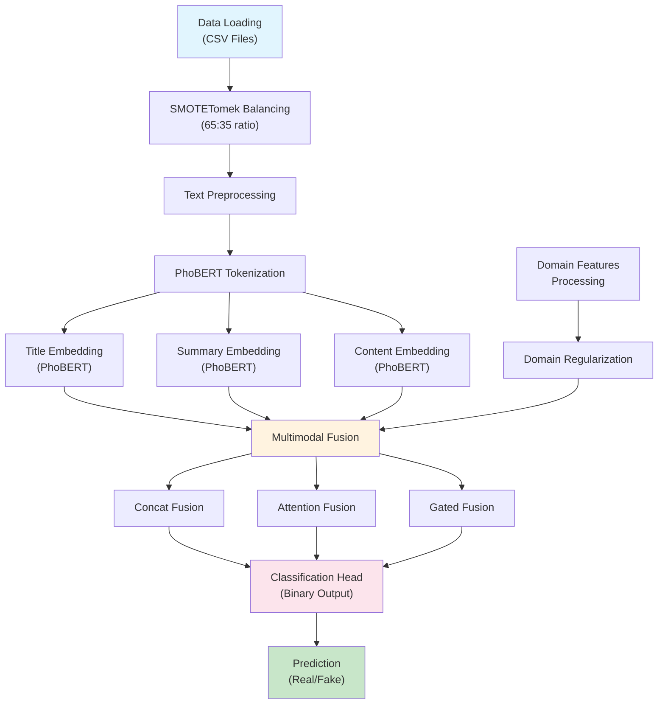

# Vietnamese Fake News Detection System

A comprehensive fake news detection system for Vietnamese text using BERT/PhoBERT fine-tuning with multimodal fusion, domain regularization, and advanced data balancing techniques.

## Overview

This system implements state-of-the-art natural language processing techniques specifically designed for Vietnamese fake news detection. The architecture leverages PhoBERT (Vietnamese BERT) with multimodal fusion strategies to analyze title, summary, and content simultaneously, achieving high accuracy through domain regularization and SMOTETomek data balancing.

### Key Features

- **End-to-end PhoBERT/BERT fine-tuning** optimized for Vietnamese text
- **Multimodal fusion** combining title, summary, content, and domain features
- **Domain regularization** to prevent domain overfitting
- **Three fusion strategies**: Concatenation, Attention, and Gated mechanisms
- **SMOTETomek data balancing** with 65:35 ratio optimization
- **Mixed precision training** (AMP) for memory efficiency
- **Comprehensive evaluation** with detailed metrics and visualizations

## System Architecture



## Project Structure

### Core Components

| File | Purpose | Description |
|------|---------|-------------|
| `main.py` | Entry Point | Main application launcher with experiment selection |
| `bert_training.py` | Model Training | Core training logic for individual model configurations |
| `main_bert_experiment.py` | Model Comparison | Automated comparison of multiple BERT configurations |
| `bert_fine_tuner.py` | Architecture Definition | Multimodal BERT fusion model implementations |
| `bert_dataset.py` | Data Handling | BERT-specific dataset and data loading utilities |

### Data Processing

| File | Purpose | Description |
|------|---------|-------------|
| `data_loader.py` | Data Pipeline | CSV loading, text preprocessing, and feature extraction |
| `data_balancer.py` | Data Balancing | SMOTETomek implementation for optimal data distribution |

### Configuration & Utilities

| File | Purpose | Description |
|------|---------|-------------|
| `config.py` | System Configuration | GPU settings, model parameters, and training configurations |
| `results_saver.py` | Results Management | Comprehensive metrics saving, plotting, and report generation |

## Installation

### Prerequisites

- Python 3.8+
- CUDA-compatible GPU (recommended)
- 8GB+ GPU memory for optimal performance

### Setup Environment

```bash
# Create virtual environment
python -m venv fake_news_env

# Activate environment
# Windows
fake_news_env\Scripts\activate
# Linux/Mac
source fake_news_env/bin/activate

# Install dependencies
pip install -r requirements_updated.txt
```

### GPU Configuration

Test your GPU configuration and get optimization recommendations:

```bash
python test_gpu.py
```

**Recommended configurations by GPU memory:**
- **4GB GPU**: batch_size=2, freeze 6 layers
- **6GB GPU**: batch_size=4, freeze 3 layers
- **8GB GPU**: batch_size=8, no freezing (recommended)
- **12GB+ GPU**: batch_size=16+, full performance

## Usage

### Data Format Requirements

Your CSV files must contain the following columns:
- `title_processed`: Preprocessed article title
- `summary_processed`: Preprocessed article summary
- `content_processed`: Preprocessed article content
- `label`: 0 (Real) or 1 (Fake)
- `domain`: Source domain (optional)

### Configure Data Paths

Edit `main.py` lines 125-126:

```python
REAL_FILE_PATH = "path/to/your/real_articles.csv"
FAKE_FILE_PATH = "path/to/your/fake_articles.csv"
```

### Running Experiments

```bash
python main.py
```

**Experiment Options:**
1. **Single Model Training**: Train one model with optimized configuration
2. **Model Comparison**: Automatically compare 5 different configurations

## Model Configurations

### Fusion Strategies

#### 1. Attention Fusion (Recommended)
Uses learnable attention weights with domain regularization to prevent overfitting:

```python
weights = F.softmax(attention_weights, dim=0)
# Domain weight constraint ≤ 15%
if domain_weight > 0.15:
    penalty = (domain_weight - 0.15) ** 2
```

#### 2. Concatenation Fusion
Simple concatenation of all embeddings:

```python
fused = torch.cat([title_emb, summary_emb, content_emb, domain_emb], dim=1)
```

#### 3. Gated Fusion
Uses gating mechanism to control information flow:

```python
gate_weights = sigmoid(gate_network(concat_embeddings))
fused = concat_embeddings * gate_weights
```

### Default Configuration

```python
{
    'bert_model': 'vinai/phobert-base',
    'fusion_type': 'attention',
    'use_domain': True,
    'num_epochs': 3,
    'batch_size': 8,
    'learning_rate': 2e-5,
    'balance_strategy': 'smotetomek'
}
```

## Performance Optimization

### Memory Management

The system includes advanced memory optimization features:

- **Automatic GPU cache clearing** before evaluation
- **CPU fallback** for insufficient GPU memory
- **Gradient checkpointing** for memory efficiency
- **Mixed precision training** (AMP) for 40% memory reduction
- **Periodic memory cleanup** during training

### Training Optimizations

```python
# Memory-efficient configuration
GPU_CONFIG = {
    'mixed_precision': True,
    'pin_memory': True,
    'prefetch_factor': 2,
    'persistent_workers': True
}
```

### Hardware-Specific Configurations

**Low Memory (≤6GB):**
```python
config = {
    'batch_size': 4,
    'max_length': 128,
    'mixed_precision': True,
    'freeze_bert_layers': 6,
    'gradient_checkpointing': True
}
```

**High Memory (≥16GB):**
```python
config = {
    'batch_size': 32,
    'max_length': 512,
    'mixed_precision': False,
    'freeze_bert_layers': 0,
    'gradient_checkpointing': False
}
```

## Expected Results

### Performance Benchmarks
- **Accuracy**: 85-92%
- **F1-Score (Fake News)**: 83-90%
- **PhoBERT** consistently outperforms Multilingual BERT for Vietnamese
- **Attention Fusion** typically achieves best results

### Training Time
- **8GB GPU**: 2-3 hours (batch_size=8)
- **12GB GPU**: 1-2 hours (batch_size=16)
- **CPU only**: 8-12 hours (not recommended)

### Output Structure
```
results_single_YYYYMMDD_HHMMSS/
├── bert_attention_best.pt                    # Best model weights
├── bert_attention_comprehensive_results.png  # Evaluation plots
├── bert_attention_detailed_metrics.json      # Detailed metrics
├── bert_attention_summary_report.txt         # Human-readable report
├── training_history.png                      # Training curves
└── experiment_config.json                    # Experiment settings
```

## Troubleshooting

### CUDA Out of Memory

```python
# Solutions in order of preference
1. Reduce batch size: batch_size = 4
2. Enable gradient checkpointing: gradient_checkpointing = True
3. Freeze BERT layers: freeze_bert_layers = 6
4. Reduce sequence length: max_length = 128
```

### Slow Training Performance

```python
# Optimization strategies
1. Increase batch size (if memory allows): batch_size = 16
2. Use mixed precision: mixed_precision = True
3. Increase data workers: num_workers = 4
4. Enable GPU optimizations: torch.backends.cudnn.benchmark = True
```

### Poor Model Performance

```python
# Debugging steps
1. Verify data balance: python data_balancer.py
2. Check domain regularization: domain_penalty_weight = 0.5
3. Try different fusion: fusion_type = 'attention'
4. Validate data quality and preprocessing
```

## Technical Specifications

### Dependencies
- PyTorch 1.9+
- Transformers 4.0+
- scikit-learn 1.0+
- imbalanced-learn 0.8+
- CUDA 11.0+ (for GPU acceleration)

### System Requirements
- **Minimum**: 8GB RAM, 4GB GPU
- **Recommended**: 16GB RAM, 8GB GPU
- **Optimal**: 32GB RAM, 12GB+ GPU

## Research & Development

This system implements cutting-edge research in Vietnamese NLP:

1. **PhoBERT Fine-tuning**: Leverages Vietnamese-specific language model
2. **Multimodal Architecture**: Processes multiple text modalities simultaneously
3. **Domain Regularization**: Prevents overfitting to specific news sources
4. **Advanced Data Balancing**: SMOTETomek for optimal class distribution
5. **Memory-Efficient Training**: Mixed precision and gradient checkpointing


